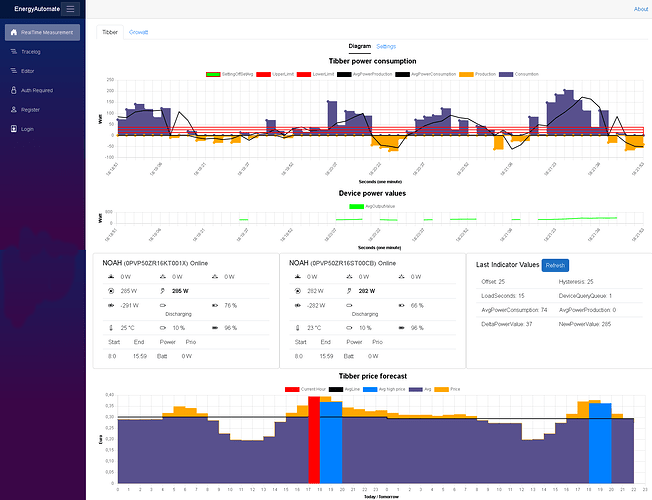

# GenericSoftware

## Description / Beschreibung

**Deutsch:**  
Die grundlegenden Informationen sind vorhanden und der Automatikmodus funktioniert.  
Zukünftig wird es einen Editor geben, der es den Nutzern ermöglicht, die Steuerungslogik zu ändern und eigene Steuerungsregeln direkt über die Weboberfläche zu erstellen.  
Eine Protokollausgabe („trace output“) wurde implementiert.  
Derzeit gibt es Probleme bei der Abfrage von Gerätedaten, da die zulässige Abfragefrequenz nicht bekannt ist.

**English:**  
The basic information is in place, and the auto mode is working.  
In the future, there will be an editor that allows users to modify the control logic and create their own control rules directly via the web interface.  
A trace output has been implemented.  
Currently, there are issues with querying device data because the allowed frequency is unknown.

### Erklärung der aktuellen `AdjustPower`-Logik  
*(Deutsch / English)*

---

## Zweck / Purpose

**Deutsch:**  
Die Methode `AdjustPower` passt den angeforderten Leistungswert (`PowerValueRequested`) für Geräte vom Typ „noah“ basierend auf aktuellen Messwerten an. Ziel ist es, Über- oder Unterversorgung zu erkennen und durch Anpassung des Leistungswerts zu vermeiden. Dazu werden Ober- und Untergrenzen (`upperlimit`, `lowerlimit`) verwendet, die aus der hinterlegten Hysterese (`SettingAvgPowerHysteresis`) und dem Sollwert (`SettingAvgPowerOffset`) berechnet werden.

**English:**  
The `AdjustPower` method adjusts the requested power value (`PowerValueRequested`) for devices of type "noah" based on real-time measurements. Its goal is to detect and prevent over- or undersupply by modifying the power value whenever necessary. It uses upper and lower limits (`upperlimit`, `lowerlimit`) derived from the configured hysteresis (`SettingAvgPowerHysteresis`) and target offset (`SettingAvgPowerOffset`).

---

## Parameter / Parameters

- **RealTimeMeasurementExtention `value`**  
  **Deutsch:** Enthält Echtzeitmesswerte sowie Felder wie `TotalPower`, `AvgPowerConsumption`, `AvgPowerProduction` und den Zeitstempel (`TS`).  
  **English:** Holds real-time measurement data such as `TotalPower`, `AvgPowerConsumption`, `AvgPowerProduction`, and the timestamp (`TS`).

- **`devices` (Liste von `Device`)**  
  **Deutsch:** Enthält alle verfügbaren Geräte vom Typ „noah“, die online sind. Wird zur Auswahl eines bestimmten Geräts verwendet.  
  **English:** Contains all available "noah" devices that are online. Used to select a specific device for power adjustments.

---

## Ablauf / Workflow

1. **Ermittlung der zu steuernden Geräteeinheit / Determining the device to adjust**  
   - **Deutsch:** Wenn die Gesamtleistung positiv ist (`value.TotalPower > 0` → Verbrauch), wird das Gerät mit dem kleinsten aktuell zugewiesenen Power-Wert ausgewählt. Ist die Gesamtleistung negativ (`value.TotalPower < 0` → Produktion), wird das Gerät mit dem größten Power-Wert ausgewählt.  
   - **English:** If total power is positive (`value.TotalPower > 0`, indicating consumption), the device with the smallest currently committed power value is selected. If total power is negative (`value.TotalPower < 0`, indicating generation), the device with the largest power value is selected.

2. **Ober-/Untergrenzen und Leistungsdeltas / Upper and lower limits, power deltas**  
   - **Deutsch:**  
     - `upperlimit` = `SettingAvgPowerOffset + (SettingAvgPowerHysteresis / 2)`  
     - `lowerlimit` = `SettingAvgPowerOffset - (SettingAvgPowerHysteresis / 2)`  
     Je nach Messwerten (`AvgPowerConsumption` oder `AvgPowerProduction`) wird geprüft, ob der Wert außerhalb dieser Grenzen liegt. Daraus ergibt sich ein „Delta“ (z. B. `consumptionDelta` oder `productionDelta`), das die Abweichung zur jeweiligen Grenze beschreibt.  
   - **English:**  
     - `upperlimit` = `SettingAvgPowerOffset + (SettingAvgPowerHysteresis / 2)`  
     - `lowerlimit` = `SettingAvgPowerOffset - (SettingAvgPowerHysteresis / 2)`  
     Depending on the measurements (`AvgPowerConsumption` or `AvgPowerProduction`), the method checks whether the values are outside these limits. A "delta" (e.g., `consumptionDelta` or `productionDelta`) indicates how far the actual values deviate from the respective limit.

3. **Berechnung des neuen Power-Werts / Calculating the new power value**  
   - **Deutsch:** Ausgehend vom zuletzt gesetzten bzw. übermittelten Wert (`lastCommitedPowerValue`) wird ein neuer Wert berechnet, indem der ermittelte Delta-Wert durch die Anzahl verfügbarer Geräte (`devices.Count`) geteilt und addiert oder subtrahiert wird.  
   - **English:** Starting from the last committed power value (`lastCommitedPowerValue`), a new power value is calculated by dividing the delta by the number of available devices (`devices.Count`) and then adding or subtracting it.

4. **Begrenzung und Validierung / Capping and validation**  
   - **Deutsch:**  
     - **Obergrenze**: `maxPower` = `SettingMaxPower / devices.Count`. Falls der berechnete Wert darüber liegt, wird er gekappt. Fällt das Ergebnis unter 0, wird es auf 0 gesetzt.  
     - Wenn sich der resultierende Wert nicht vom bereits angeforderten unterscheidet, erfolgt keine erneute Übermittlung.  
   - **English:**  
     - **Upper limit**: `maxPower` = `SettingMaxPower / devices.Count`. If the calculated value exceeds that limit, it is capped. If it goes below 0, it’s set to 0.  
     - If the resulting value does not differ from the already requested one, no further update is sent.

5. **Übermittlung des neuen Werts / Sending the new value**  
   - **Deutsch:** Wird ein neuer Wert ermittelt, wird dieser in `device.PowerValueRequested`, `value.RequestedPowerValue` sowie über eine Warteschlange (`DeviceQueryQueueWatchdog`) an das entsprechende Gerät übermittelt.  
   - **English:** If a new value is computed, it is stored in `device.PowerValueRequested`, `value.RequestedPowerValue`, and then sent to the corresponding device via the `DeviceQueryQueueWatchdog` queue.

6. **Logging und Aktualisierung / Logging and refresh**  
   - **Deutsch:** Bei Überschreitungen der Limits werden Debug-Informationen per `Trace.WriteLine` ausgegeben. Danach wird ein UI-Update über `ApiService.InvokeStateHasChanged()` ausgelöst.  
   - **English:** When the limits are exceeded, debug information is written via `Trace.WriteLine`. A UI refresh is triggered by calling `ApiService.InvokeStateHasChanged()`.

---

### Zusammenfassung / Summary

**Deutsch:**  
Die Methode `AdjustPower` überprüft in regelmäßigen Abständen den aktuellen Energieverbrauch bzw. die Energieerzeugung. Liegen diese außerhalb definierter Grenzen, wird der angeforderte Leistungswert für das betreffende Gerät so verändert, dass eine Über- oder Unterversorgung ausgeglichen wird. Eine Obergrenze stellt sicher, dass das Gerät nicht mehr Leistung anfordert, als konfiguriert ist.  

**English:**  
The `AdjustPower` method periodically checks current consumption or production. If it is outside the defined thresholds, it adjusts the requested power value for the relevant device to avoid over- or undersupply. A maximum limit ensures the device does not request more power than configured.